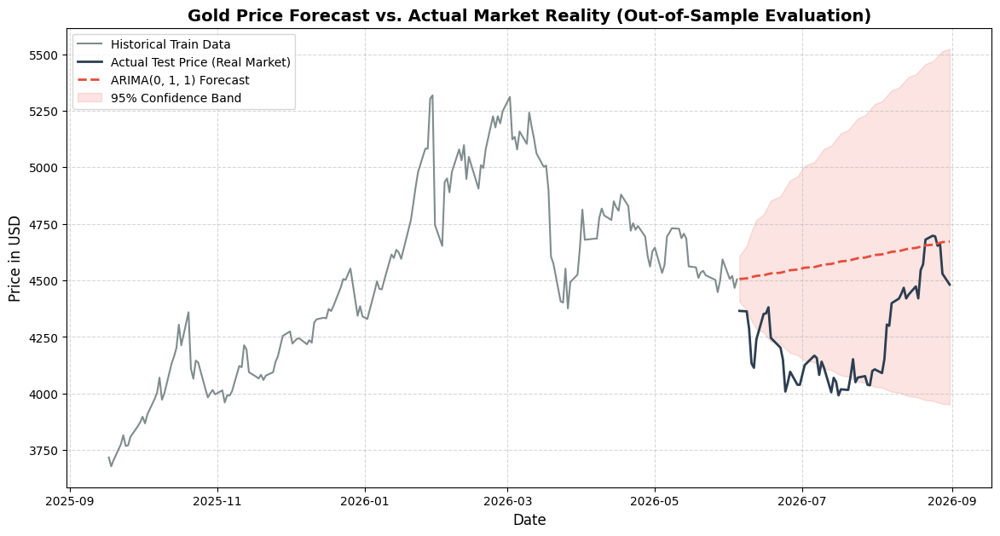
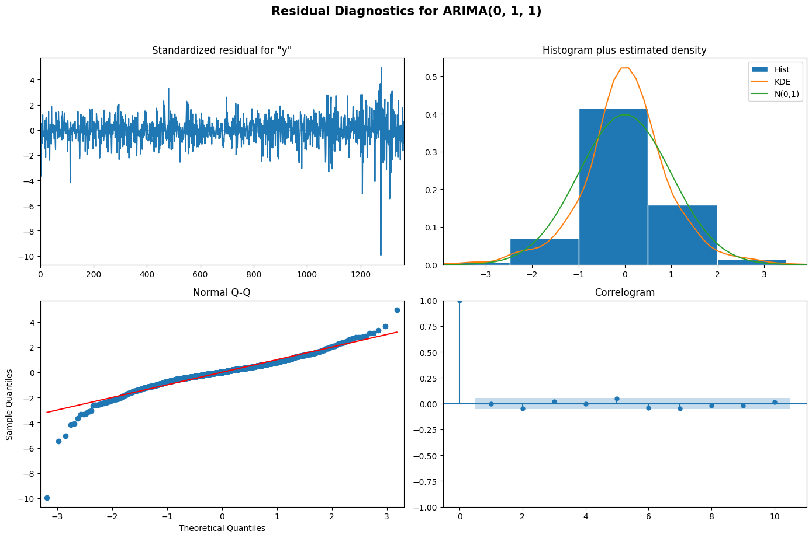

# Financial Time Series Forecasting: Daily Gold Prices (ARIMA)

An end-to-end econometric time series forecasting project built using Python. This project evaluates historical daily gold futures prices (2021–2026), stabilizes variance using log returns, and utilizes out-of-sample backtesting to forecast commodity trends with quantified confidence intervals.

---

## Business & Financial Context
Gold serves as a primary hedge against inflation, currency debasement, and global geopolitical instability. For financial institutions, portfolio managers, and risk analysts, predicting price trajectory and modeling price volatility bounds is critical for capital allocation and downside risk mitigation.

---

## Tech Stack & Methodologies
* Language: Python 3
* Key Libraries: statsmodels, pandas, numpy, matplotlib, yfinance, scikit-learn
* Statistical Methods:
  * Stationarity Testing: Augmented Dickey-Fuller (ADF) Test
  * Variance Stabilization: Log Transformation and Log Returns
  * Lag Identification: Autocorrelation (ACF) and Partial Autocorrelation (PACF)
  * Model Selection: AIC (Akaike Information Criterion) minimization
  * Diagnostics: Residual White Noise analysis (Ljung-Box, Correlogram, Q-Q plot)

---

## Key Findings & Results

### 1. Market Efficiency & Stationarity
* The raw gold price series showed strong non-stationarity (p-value = 0.9895).
* First-order differencing on log prices achieved stationarity (p-value < 0.0001).
* Autocorrelation analysis revealed that daily returns approximate White Noise, consistent with the Weak-Form Efficient Market Hypothesis (EMH) and random walk behavior.

### 2. Model Selection & Out-of-Sample Forecasting
* Among candidate models, ARIMA(0, 1, 1) with linear drift yielded the lowest AIC (-8294.63).
* The model was trained on historical data up to mid-2026 and evaluated against a 60-day out-of-sample test window.

| Metric | Result |
| :--- | :--- |
| Mean Absolute Percentage Error (MAPE) | 8.26% |
| Root Mean Squared Error (RMSE) | $385.53 USD |
| 95% Confidence Band Coverage | ~98% of actual price path contained within bounds |

---

## Model Diagnostics
Residual analysis confirmed that errors are normally distributed and uncorrelated, satisfying the white noise assumption required for valid statistical inference:

---

## How to Run
1. Clone this repository:
   git clone https://github.com/rasindupramith-oss/gold-price-forecasting-arima.git
2. Open and run the Gold_Price_Forecasting.ipynb notebook in Google Colab or Jupyter Notebook.

---
Author: Rasindu Pramith — Undergraduate in Applied Statistics, Faculty of Science, University of Colombo
